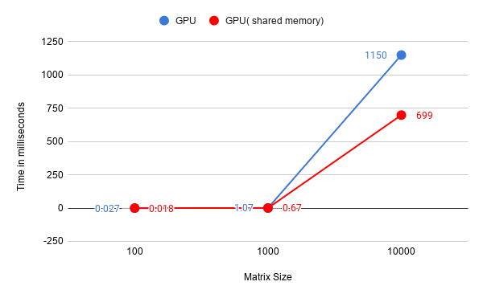

# Lab2

Comparison of Matrix Multiplication on CPU, GPU and using shared memory on GPU

| method/size            | 100        | 1000      | 10000      |
| :--------------------: | :--------: | :-------: | :--------: |
| CPU                    | 0.014      | 6.124     | 13026.90   |
| GPU                    | 0.000027   | 0.00107   | 1.150      |
| GPU  (shared memory)   | 0.000018   | 0.00067   | 0.699      |

*\*\* Time mentioned is in seconds*

The speedup graph for the with/without shared memory implementations is shown below:

